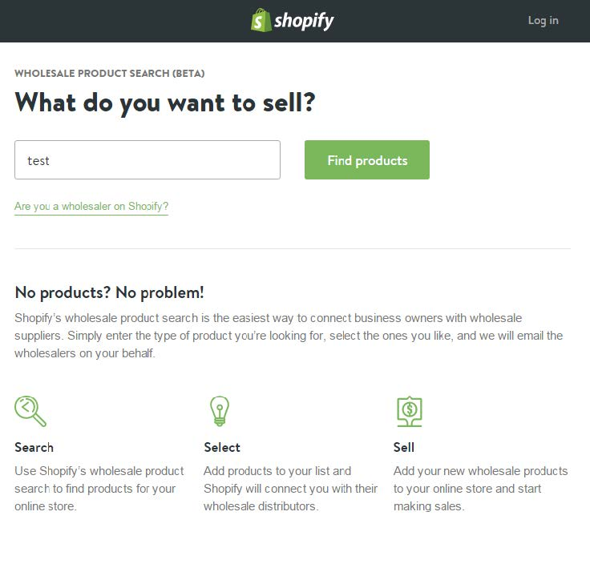
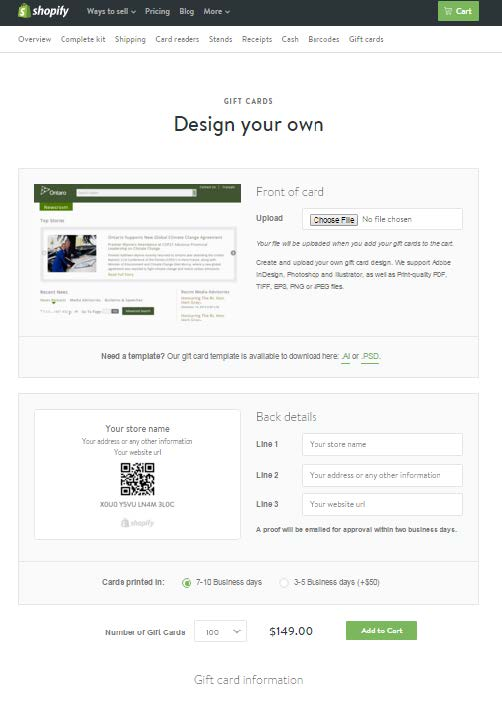
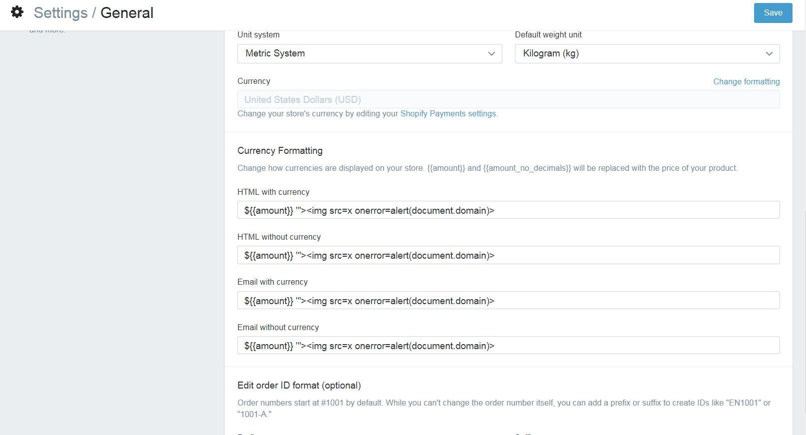
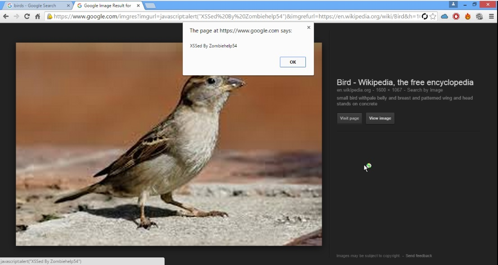

# 十、跨站脚本攻击

> 作者：Peter Yaworski

> 译者：[飞龙](https://github.com/)

> 协议：[CC BY-NC-SA 4.0](http://creativecommons.org/licenses/by-nc-sa/4.0/)

## 描述

跨站脚本，或者 XSS，涉及到站定包含非预期的 JavaScript 脚本代码，它随后传给用于，用户在浏览器中执行了该代码。它的一个无害示例为：

```js
alert('XSS');
```

这会调用 JavaScript 函数`alert`，并创建一个简单的弹出窗口，带有文本`XSS`。现在，在这本书的前一个版本中，我推荐你在报告中使用这个例子。但是，一个非常成功的黑客告诉我这是个糟糕的例子，因为漏洞的接收者通常没有意识到这个问题的严重性，并且可能由于无害的示例而得到较低的奖金。

所以，考虑到这种情况，使用示例开判断 XSS 是否存在，但是报告时，考虑漏洞如何影响站点，并解释它。通过这样，我并不是告诉厂商什么事 XSS，而是解释你可以使用它做什么事，来影响他们的站点。

这应该包含识别你报告了何种 XSS，它们包括：

+   反射型 XSS：这些攻击并不是持久的，意思是 XSS 传递后通过简单的请求和响应执行。

+   存储型 XSS：这些攻击是持久的，或已保存，之后在页面加载时执行给无意识的用户。

+   Self XSS：这些攻击也不是持久的，通常作为戏弄用户的一部分，使它们自己执行 XSS。

当你搜索漏洞时，你会经常发现，厂商不关心 Self XSS，它们只关心，它们的用户是否自身存在缺陷，就像反射和存储 XSS 的例子那样。但是，这并不是说，你应该完全忽略 Self XSS。

如果你发现了一个场景，其中 Self XSS 可以执行，但是不会存储，你需要考虑该漏洞是否可以利用，是否有些东西可以结合起来，使其不再是 Self XSS？

最著名的 XSS 利用示例之一，就是 Samy Kamkar 执行的 MySpace Samy 蠕虫。在 2005 年 10 月，Samy 利用了一个 MySpace 上的存储型 XSS 漏洞，允许它上传 JavaScript 脚本。这个代码随后在任何人浏览它的 MySpace 主页时执行，因此使任何 Samy 用户资料的浏览者成为其好友。但是，更多的是，这个代码也复制其自身到 Samy 新朋友的页面，所以受感染页面的浏览者使用下面这段话更新了它们的资料页面：“but most of all, samy is my hero”（最重要的是，Samy 是我的英雄）。

虽然 Samy 的利用并不完全是恶意的，XSS 利用使其能够盗取用户、密码、银行信息以及其他。虽然具有潜在的影响，修复 XSS 漏洞通常很简单，只需要软件开发者在渲染时转义用户输入（就像 HTML 注入那样）。在攻击者提交它们的时候，一些站点也会截断可能的恶意字符。

> 链接

> 查看 [OWASP XSS 过滤器绕过速查表](https://www.owasp.org/index.php/XSS_Filter_Evasion_Cheat_Sheet)。

## 示例

### 1\. Shopify Wholesale

难度：低

URL：` wholesale.shopify.com `

报告链接：`https://hackerone.com/reports/106293`

报告日期：2015.12.21

奖金：$500

描述：

Shopify Wholesale 站点是一个简单的页面，拥有不同的操作调用 -- 输入商品名称并且点击“搜索商品”，这里是截图：



Shopify Wholesale 站点截图

这里的 XSS 漏洞是你可以找到的最基本的漏洞 - 输入到搜索框中的文本并没有转移，所以任何输入的 JavaScript 都会执行。这里是漏洞披露中的提交文本：`test’;alert(‘XSS’);’ `。

它生效的原因是，Shopify 接收用户输入，执行搜索查询，当没有结果返回时，Shopify 会打印一条消息，说该名称下没有找到任何商品，之后重新打印出用户输入，而没有任何转义。因此，提交的 JavaScript 打印到了页面上，浏览器将其解释为 JavaScript 并执行。

> 重要结论

> 测试任何东西，特别要关注一些场景，其中你所输入的文本渲染给了你。测试来判断你是否可以包含 HTML 或者 JavaScript，来观察站点如何处理它。同时尝试编码输入，就像在 HTML 注入一章中描述的那样。

> XSS 漏洞并不需要很复杂。这个漏洞是你能找到的最基本的东西 - 一个简单的输入文本字段，这个漏洞并不处理用户输入。它在 2015 年 12 月 21 日发现，并获得了 $500 的奖金。它所需要的所有东西，就是黑客的思维。

### 2\. Shopify 礼品卡购物车

难度：低

URL：` hardware.shopify.com/cart `

报告链接：`https://hackerone.com/reports/95089`

报告日期：2015.10.21

奖金：$500

描述：

Shopify 礼品卡站点允许用户使用 HTML 表单设计它们自己的礼品卡，具体来说，这包括一个上传输入框，一些文本框，以及其他。这里是一个截图：



Shopify 礼品卡表单截图

这里的 XSS 漏洞在 JavaScript 输入到了表单图像名称字段时出现。在使用 HTML 代理完成之后，会出现一个不错的简单任务。所以这里，原始的表单提交会包含：

```
Content-Disposition: form-data; name="properties[Artwork file]"
```

这会被解释和修改为：

```
Content-Disposition: form-data; name="properties[Artwork file]";
```

> 重要结论

> 这里有两个东西要注意，这会在寻找 XSS 漏洞时帮助你：

> 1.  这里的漏洞实际上并不在文件输入字段本身 -- 它在字段的名称属性中。所以当你寻找 XSS 漏洞的机会时，要记住玩转所有可用的输入值。

> 2.  这里的值在通过代理操作之后提交。在一些场景中这是关键，其中在任何值实际提交给服务器之前，客户端（你的浏览器）可能存在 JavaScript 来验证值。

> **实际上，任何时候你看到验证实时发生在你的浏览器中，这都是一个信号，你需要测试这个字段！**开发者可能犯下这个错误，一旦这些值提交给了服务器，它们不验证提交的值是否存在恶意代码，因为它们认为浏览器的 JavaScript 代码已经在输入接收之前验证过了。

### 3\. Shopify 货币格式

难度：低

URL：`SITE.myshopify.com/admin/settings/generalt `

报告链接：`https://hackerone.com/reports/104359`

报告日期：2015.12.9

奖金：$1000

描述：

Shopify 的商店设置包含修改货币格式的功能。在 12 月 9 日，有报告称，这些输入框的值在建立社交媒体页面时，没有合理处理。

换句话说，恶意用户可以建立一个商店，并将货币设置修改为下面这个：



Shopify 货币格式截图

之后，用户就可以开启社交媒体售卖频道。报告中的例子是 Fackbook 和 Twitter，以及当用户点击这个售卖频道的选项卡之后，JavaScript 会执行，产生 XSS 漏洞。

> 重要结论

> XSS 漏洞在 JavaScript 文本不安全渲染时产生。文本可能用于站点的多个位置，所以每个位置都应该测试。这里，Shopify 并没有在商店和收款页面包含 XSS，因为用户允许在它们的商店中使用 JavaScript。在考虑字段是否用于外部社交媒体站点之前，很容易把这个漏洞补上。

### 4\. 雅虎邮件存储型 XSS

难度：低

URL：Yahoo Mail

报告链接：`https://klikki.fi/adv/yahoo.html`

报告日期：2015.12.26

奖金：$10000

描述：

雅虎邮件编辑器允许人们将图片通过 HTML IMG 标签嵌入到邮件中。这个漏洞在 HTML IMG 标签格式错误或者无效时出现。

多数 HTML 标签接受属性，它是有关 HTML 标签的额外信息。例如，IMG 标签接受`src`属性，指向要渲染的图像的地址。此外一些属性是布尔属性，意思是如果他们存在，他们在 HTML 表现为真值，而当他们被忽略时，他们表现为假值。

对于这个漏洞，Jouko Pynnonen 发现，如果它将布尔属性添加到 HTML 标签中，并带有一个值，雅虎邮件就会移除该值但保留等号。这里是来自`Klikki.fi`的一个例子：

```html
<INPUT TYPE="checkbox" CHECKED="hello" NAME="check box">
```

这里，输入标签可能包含`checked`属性，表示复选框是否渲染为选中。根据上面描述的歇息，这会变成：

```html
<INPUT TYPE="checkbox" CHECKED= NAME="check box">
```

要注意 HTML 从拥有`checked`值变成了没有值但是仍然包含等号。

这看起来是无害的，但是根据 HTML 规范，浏览器将这个`CHECKED`看做拥有值`NAME=”check`，并且该`input`标签有用第三个属性`box`，它没有值。这是对于没有引号的属性值，因为 HTML 允许零个或多个空格字符在等号周围。

为了利用它，Jouko 提交了下面的 IMG 标签：

```html

```

雅虎邮件会把它变成：

```html

```

因此，浏览器会渲染 IMG 标签，它占据整个浏览器的窗口，当鼠标移到图片上的时候，会执行 JavaScript。

> 重要结论

> 传递格式错误或损坏的 HTML 是个不错的方法，来测试站点如何解析输入。作为一个黑客，考虑到开发者没有考虑的东西十分重要。例如，使用常规的图片标签，如果你传递两个`src`属性会怎么样？它会如何渲染？

### 5\. Google 图片搜索

难度：中

URL：` images.google.com `

报告链接：`http://zombiehelp54.blogspot.ca/2015/09/how-i-found-xss-vulnerability-in-google.html`

报告日期：2015.9.12

奖金：未知

描述：

2015 年 9 月，Mahmoud Jamal 使用 Google 图像来为它的 HackerOne 资料寻找一个图片。在浏览的时候，它注意到 Google 图片的 URL 中有一些有趣的东西。

```
http://www.google.com/imgres?imgurl=https://lh3.googleuser.com/...
```

注意到实际的 URL 中存在 `imgurl`的引用。在鼠标移到缩略图上的时候，Mahoumd 注意到了锚标签的`href`属性包含了相同的 URL。因此，它尝试将参数改为` javascript:alert(1)`，并且注意到锚标签的`href`也改为了相同值。

它这个时候非常激动，点击了链接，但是没有执行 JavaScript，因为 Google URL 改为了别的东西。结果，Google 的代码在鼠标按下时，通过`onmousedown` JavaScript 回调修改了 URL。

考虑到这个，Mahmoud 决定使用它的键盘，尝试使用 TAB 键在页面上切换。当他来到`View Image`按钮时，触发了 JavaScript，产生了 XSS 漏洞。这里是图片：



Google XSS 漏洞

> 重要结论

> 始终留意这种漏洞。很轻易就能假设，仅仅由于公司太大或者太知名，任何东西都被找到了。但是，公司始终会修改代码。

> 此外，有大量方法来执行 JavaScript，这里在看到 Google 使用`onmousedown`事件处理器修改值之后，很容易就放弃了。这意味着任何时候使用鼠标点击了链接，值都会改变。
