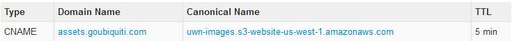
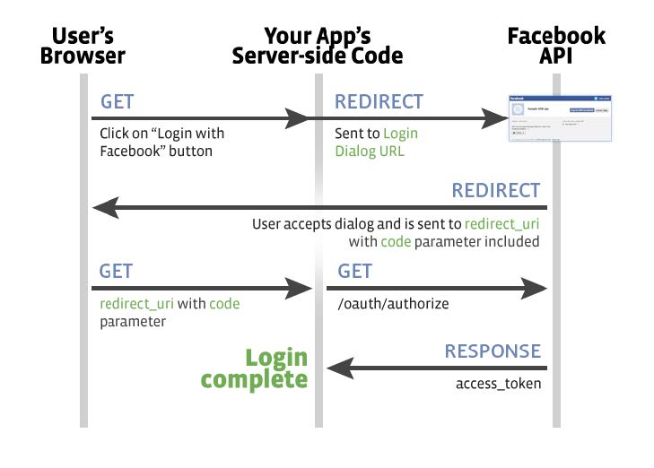

# 十三、子域劫持

> 作者：Peter Yaworski

> 译者：[飞龙](https://github.com/)

> 协议：[CC BY-NC-SA 4.0](http://creativecommons.org/licenses/by-nc-sa/4.0/)

## 描述

子域控制就真的是听上去那样，它是一种场景，恶意用户能够代表合法站点来申请一个子域。总之，这一类型的漏洞涉及站点为子域创建 DNS 记录，例如，Heroku（主机商），并且从未申请过该子域。

1.  `example.com`在Heroku 上注册。

2.  `example.com`创建 DNS 记录`subdomain.example.com`，指向`unicorn457.heroku.com`。

3.  `example.com`没有申请`unicorn457.heroku.com `。

4.  恶意用户申请了`unicorn457.heroku.com `，并复制了`example.com`。

5.  所有`subdomain.example.com`的流量都会流经恶意网站，它看上去类似`example.com`。

所以，按照这个逻辑，DNS 条目需要指向未申请的外部服务，例如 Heroku，Github 和 Amazon S3。发现它们的一个不错的方法是使用 KnockPy，它会在工具一节中讨论，它迭代了子域的常见列表来验证是否存在。

## 示例

1\. Ubiquiti 子域劫持

难度：低

URL：`http://assets.goubiquiti.com`

报告链接：`https://hackerone.com/reports/109699`

报告日期：2016.1.10

奖金：$500

描述：

就像子域劫持的描述中所述，`http://assets.goubiquiti.com`拥有指向 Amazon S3 文件存储的 DNS 记录，但是不存在实际的 Amazon S3 容器。这里是 HackerOne 的截图：



因此，恶意用户可以申请`uwn-images.s3-website-us-west-1.amazonaws.com `，并在这里部署站点。假设它可以更加类似 Ubiquiti，这里的漏洞是诱使用户来提交个人信息，并控制账户。

> 重要结论

> DNS 记录提供了全新并独特的漏洞利用机会。使用KnockPy 来尝试验证子域是否存在，之后确认它们指向有效的资源，并且特别注意三方服务，例如 AWS、Github、Zendesk 以及其他。这些服务允许你注册自定义的 URL。

### 2\. Scan.me 的 Zendesk 指向

难度：低

URL：`support.scan.me `

报告链接：`https://hackerone.com/reports/114134`

报告日期：2016.2.2

奖金：$1000

描述：

就像 Ubiquiti 的示例那样，这里 Scan.me 拥有一个 DNS 记录，将`support.scan.me `指向` scan.zendesk.com`。这种情况下，黑客` harry_mg `就能够申请` scan.zendesk.com`，`support.scan.me`指向了它。

就是这样了，奖金是 $1000。

> 重要结论

> 要注意！这个漏洞与 2016 年 2 月发现，并且完全不复杂。成功的漏洞挖掘需要敏锐的观察。

### 3\. Facebook 官方的访问 Token

难度：高

URL：`facebook.com`

报告链接：`http://philippeharewood.com/swiping-facebook-official-access-tokens`

报告日期：2016.2.29

奖金：未公开

描述：

我不知道这是否符合子域劫持的技术定义（如果有的话），但是我觉得这是个重大的发现，让 Philippe 能够以最少的交互劫持任意 Facebook 账户。

为了理解这个漏洞，我们需要看一看 OAuth，根据他们的站点，它是一个开放协议，能够以简单和标准的方式来验证 Web 移动和桌面应用的安全性。换句话说，OAuth 允许用户授权某个应用来代表它们，而不需要向应用分享密码。如果你曾经浏览器过某个站点，它让你使用你的 Google、Facebook、Twitter 以及其他账户来登录，你就使用了 OAuth。

现在，假设你注意到了这里的潜在利用。如果 OAuth 允许用户授权，错误实现的影响非常之大。理解了这个过程之后，Philippe 提供了一副不错的图片来解释协议是如何实现的。



Philippe Harewood - Facebook OAuth 流程

总之，我们可以在这里看到：

1.  用户通过一些 APP 请求将 Facebook API 使用一些目的。

2.  这个 APP 将用户重定向到 Facebook API 来授予权限。

3.  Facebook API 向用户提供代码并将其重定向到 APP。

4.  APP 接受代码并调用 Facebook API 来获得 Token。

5.  Facebook 返回 Token 给 APP，它代表用于为调用授权。

这个流程中，你会注意到用户在哪儿都不需要向访问它们账户的 APP 提供他们的 Facebook 用户名和密码。这也是个概览，这里也可能出现很多其他事情，包括可以在流程中交换的额外信息。

这里有一个重大漏洞，Facebook 在 #5 中向应用提供访问 Token。

再回头考虑 Philippe 的发现，它详细解释了如何尝试并捕获这些 Token，来诱使 Facebook 向他发送它们，而不是那个应用。但是，反之，它决定寻找能够控制的，存在漏洞的 Facebook 应用。

结果，每个 Facebook 用户都使用它们的账户授权的应用，但是许多都不显式使用。根据他的 Write Up，一个例子是“Content Tab of a Page on www”，它在 Facebook 粉丝页面加载了一些 API 调用。APP 的列表课在`https://www.facebook.com/search/me/apps-used`上获取。

浏览器这个列表之后，Philippe 设法找到了一个 APP，它的配置是错误的，并且可用于使用请求来捕获 Token，请求为：

```
https://facebook.com/v2.5/dialog/oauth?response_type=token&display=popup&client_id=APP_ID&redirect_uri=REDIRECT_URI
```

这里，它所使用来获取`APP_ID`的应用，是拥有完整权限并配置错误的，意思是步骤 #1 和 #2 已经完成了，用户不会看到弹出窗口来向应用授予权限，因为它们实际上已经完成了。此外，由于 Facebook 并不持有`REDIRECT_URI`，Philippe 实际上可以持有它，准确来说就像子域那样。因此，当用户点击了它的链接，它们会重定向到：

http://REDIRECT_URI/access_token_appended_here

Philippe 可以使用它来记录所有访问 Token，并劫持 Facebook 账户。更加 NB 的是，根据它的博文，一旦你拥有了官方的 Facebook 访问 Token，你就拥有了莱斯其他 Facebook 应用的 Token，例如 Instagram。他需要做的所有事情就是调用 Facebook GraphQL（一个用于从 Facebook 获取数据的 API），响应就会包含用于请求中 APP 的`access_token`。

> 重要结论

> 我觉得你可能想知道，为什么这个例子会包含在这本书的这个章节。对我来说，最重要的结论就是。要考虑到在渗透过程中如何利用一些遗留资源。在这一章的上一个例子中，DNS 指向了不再继续使用的服务。这里，寻找了预先审批了不再使用的应用。当你渗透的时候，要寻找这些应用的变化，它们可能会给你留下公开的资源。

> 此外，如果你喜欢这个例子，你可以查看 Philippe 的博客（包含在资源一章，以及“ Hacking Pro Tips Interview”，这是他坐下来和我一起完成的，他提供了很多不错的建议）。

## 总结

当一个站点已经创建了无用的 DNS 记录，指向三方服务提供商，子域劫持真的不难以完成。有很多方法来发现它们，包括使用 KnockPy，Google Hack（`site:*.hackerone.com`），Recon-ng，以及其他。这些东西的用法都包含在这本书的工具一章。

此外，就像前面那个 Facebook 访问 Token 的示例那样，当你考虑这种类型的漏洞时，扩展你的领域，并且考虑目标上存在什么过时的遗留资源。例如，` redirect_uri`和预先审批的 Facebook APP。
