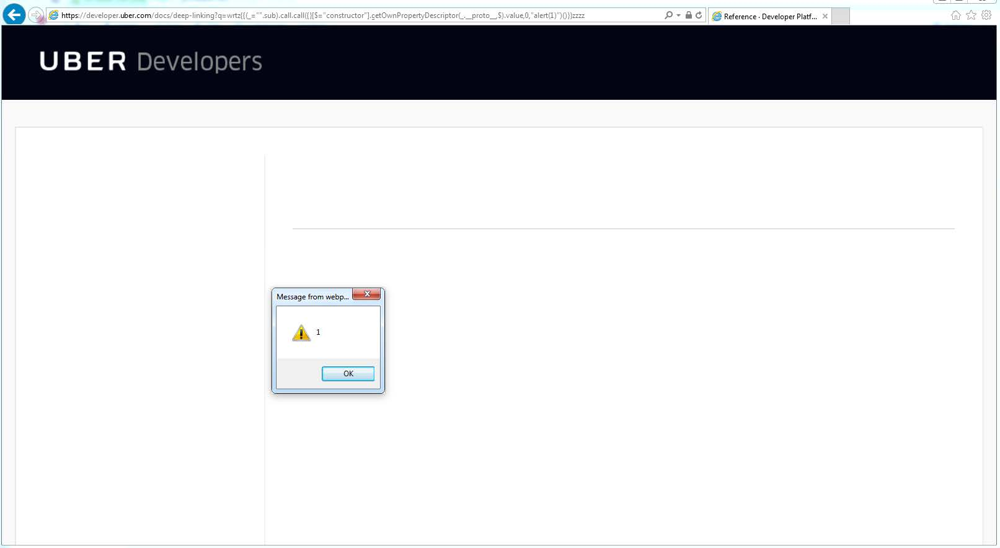
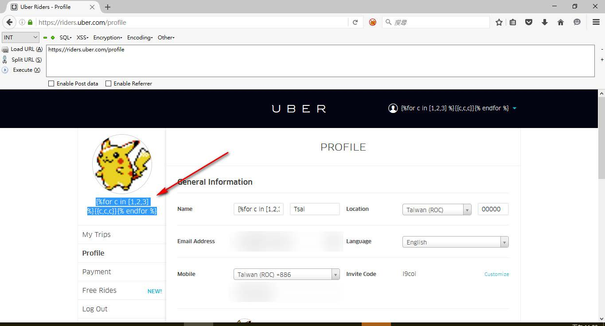
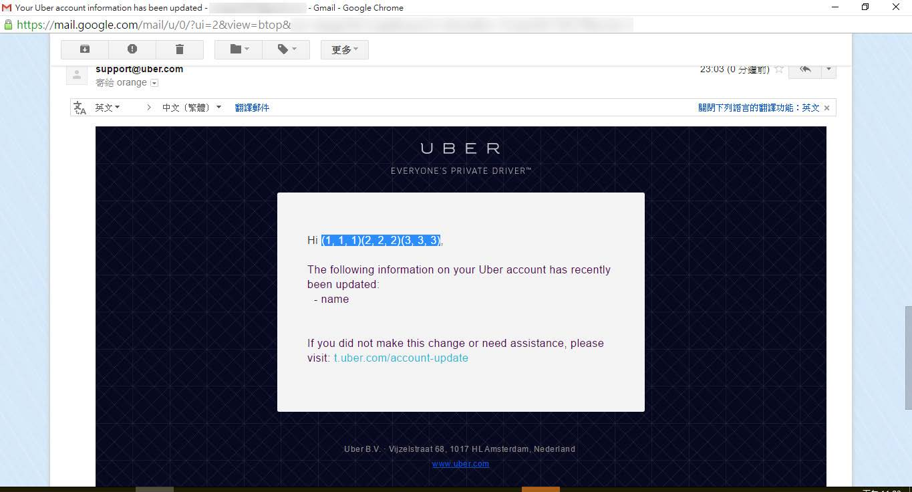

# 十六、模板注入

> 作者：Peter Yaworski

> 译者：[飞龙](https://github.com/)

> 协议：[CC BY-NC-SA 4.0](http://creativecommons.org/licenses/by-nc-sa/4.0/)

模板引擎是允许开发者或设计师在创建动态网页的时候，从数据展示中分离编程逻辑的工具。换句话说，除了拥有接收 HTTP 请求的代码，从数据库查询必需的数据并且之后将其在单个文件中将其展示给用户之外，模板引擎从计算它的剩余代码中分离了数据的展示（此外，流行的框架和内容管理系统也会从查询中分离 HTTP 请求）。

服务端模板注入（SSTI）在这些引擎渲染用户输入，而不合理处理它的时候发生，类似于 XSS，例如，jinja2 是 Python 的模板语言，取自 nVisium，一个 404 错误页面的示例为：

```py
@app.errorhandler(404) 
def page_not_found(e): 
    template = '''{%% extends "layout.html" %%} 
    {%% block body %%} 
    <div class="center-content error"> 
        <h1>Opps! That page doesn't exist.</h1> 
        <h3>%s</h3> 
    </div> 
    {%% endblock %%} 
    ''' % (request.url) 
    return render_template_string(template), 404
```

来源：https://nvisium.com/blog/2016/03/09/exploring-ssti-in-flask-jinja2

这里，`page_not_found`函数渲染了 HTML，开发者将 URL 格式化为字符串并将其展示给用户。所以，如果攻击者输入了`http://foo.com/nope{{7*7}}`，开发者的代码会渲染`http://foo.com/nope49,`，实际上求解了传入的表达式。当你传入实际的 Python 代码，并且 jinja2 会求值时，它的严重性还会增加。

现在，每个 SSTI 的严重性取决于所用的模板引擎，以及在该字段上进行何种验证（如果有的话）。例如，jinja2 存在任意文件访问和远程代码执行，Rails 的 ERB 模板引擎存在远程代码执行，Shopify 的 Liquid 引擎允许访问受限数量的模板方法，以及其他。展示你所发现的严重性实际上取决于测试什么是可能的。并且虽然你可能能够求解一些代码，它可能最后不是重要的漏洞。例如，我通过使用载荷`{{4+4}}`来发现了 SSTI，它返回了 8。但是，当我使用`{{4*4}}`，返回了文本`{{44}}`，因为星号被过滤了。这个字符安也溢出了特殊字符，例如`()`和`[]`，仅仅允许最大 30 个字符。所有这些组合起来使 SSTI 变得无用。

与 SSTI 相反的是客户端模板注入（CSTI），要注意这里的 CSTI 不是一个通用的漏洞缩写，像这本书的其它缩写一样，我推荐将其用于报告中。这个漏洞在应用使用客户端模板框架时出现，例如 AngularJS，将用户内容嵌入到 Web 页面中而不处理它。它非常类似于 SSTI，除了它是个客户端框架，产生了漏洞。 Angular 中 CSTI 的测试类似于 jinja2 并且设计使用`{{}}`和其中的一些表达式。

## 示例

### 1\. Uber Angular 模板注入

难度：高

URL：`developer.uber.com`

报告链接：`https://hackerone.com/reports/125027`

报告日期：2016.3.22

奖金：$3000

描述：

2016 年 3 月，James Kettle（Burp 的开发者之一，在工具一章所推荐的工具）使用 URL `https://developer.uber.com/docs/deeplinking?q=wrtz{{7*7}}`发现了 CSTI 漏洞。根据他的报告，如果你查看并渲染了页面源码，字符串`wrtz49`是存在的，表明该表达式被求值了。

现在，有趣的是，Angular 使用叫做沙箱的东西来“维护应用职责的合理分离”。有时这种由沙箱提供的分离设计为一种安全特性，来限制潜在的攻击者可访问的东西。但是，对于 Angular 来说，文档中写着“这个沙箱并不用于阻止想要编辑模板的攻击者，而且在两个花括号的帮定种可能运行任意代码。”之后，James 设法这样做了。

使用下面的 JavaScript，James能够绕过 Angular 沙箱并且执行任意 JavaScript 代码：

```
https://developer.uber.com/docs/deep-linking?q=wrtz{{(_="".sub).call.call({}[$="constructor"].getOwnPropertyDescriptor(_.__proto__,$).value,0,"alert(1)")()}}zzzz
```



Uber 文档中的 Angular 注入

它注意到，这个漏洞可以用于劫持开发者账户，以及关联 APP。

> 重要结论

> 一定要注意 AngularJS 的使用，并使用 Angular 语法`{{}}`来测试字段。为了使你更加轻松，使用 Firefox 的插件 Wappalyzer - 它会向你展示站点使用了什么软件，包含 AngularJS。

### 2\. Uber 模板注入

难度：中

URL：`riders.uber.com`

URL：`hackerone.com/reports/125980`

报告日期：2016.3.25

奖金：$10000

描述：

Uber 在 HackerOne 发起它们的公开漏洞奖励计划时，它们也包含了一个“寻宝图”，它可以在它们的站点找到，`https://eng.uber.com/bug-bounty`。

这个地图记录了 Uber 所使用的的一些敏感的子域，包含彼此依赖的技术。所以，对于问题中的站点来说，` riders.uber.com`，技术栈包括 Python Flask 和 NodeJS。所以，对于这个漏洞，Orange（攻击者）注意到了所用的 Flask 和 Jinja2，并在名称字段测试语法。

现在，在测试过程中，Orange 注意到了任何`riders.uber.com`上个人资料的修改，都会发送一封邮件，以及一个文本消息给账户拥有者。所以，根据他的博文，他测试了`{{1+1}}`，这导致站点解析了表达式并在给它的邮件中打印了`2`。

下面它尝试了载荷` {{c,c,c}}  `，它执行了一个`for`循环并产生了下面的个人资料页面：



载荷注入后的`blog.organge.tw ` Uber 资料

这是产生的邮件：



载荷注入后的`blog.organge.tw` Uber 邮件

你可以看到，在个人资料页面，实际的文本被渲染了，但是邮件实际上执行了代码并将其注入到邮件中。因此，漏洞是存在的，允许攻击者执行 Python 代码。

现在，Jinja2 尝试通过将执行放入沙箱中来缓和伤害，意思是功能有限，但是偶尔能被绕过。这个报告最开始由一个博文支持（它在更早的时候发布），并包含一些` nVisium.com`博客的不错的链接（是的，执行 Rails RCE 的同一个），它展示了如何绕过沙箱的功能：

+   https://nvisium.com/blog/2016/03/09/exploring-ssti-in-flask-jinja2
+   https://nvisium.com/blog/2016/03/11/exploring-ssti-in-flask-jinja2-part-ii

> 重要结论

> 要注意站点使用什么功能，这些通常是如何利用站点的关键信息。这里，Flask 和 Jinja2 变成了极好的攻击向量。并且，在这个有一些 XSS 漏洞的例子中，漏洞可能不是那么直接或者明显，要确保检查了所有文本渲染的地方。这里，Uber 站点的资料名称展示了纯文本，但是邮件实际上存在漏洞。

### 3\. Rails 动态渲染器

难度：中

URL：无

报告链接：`https://nvisium.com/blog/2016/01/26/rails-dynamic-render-to-rce-cve-2016-0752`

报告日期：2015.2.1

奖金：无

描述：

在这个利用的研究中，nVisium 提供了一个 NB 的截断和遍历。基于他们的 WriteUp，RoR 的控制器在 Rails APP 中负责业务逻辑。这个框架提供了一些不错的健壮的功能，包括哪些内容需要渲染用户，基于传给渲染方法的简单值。

处理 Rails 的时候，开发者能够隐式或者显式控制渲染什么，基于传给函数的参数。所以，开发者能够显式控制作为文本、JSON、HTML，或者一些其他文件的内容。

使用这个功能，开发者就能够接收在 URL 中传入的参数，将其传给 Rails，它用于判断要渲染的文件。所以，Rails 会寻找一些东西，例如`app/views/user/#{params[:template]}`。

nVisium 使用了在后台中传递的示例，它可能会渲染`.html`、`.haml`、`.html.reb`后台视图。收到调用之后，Rails 会在目录中扫描匹配 Rails 约定的文件类型（Rails 的理念是约定优于配置）。但是，当你让 Rails 渲染一些东西，并且它找不到合适的文件来使用，他就会在`RAILS_ROOT/app/views`，`RAILS_ROOT`和系统根目录中搜索。

这就是问题的一部分。`RAILS_ROOT`指代你的 APP 的根目录，在这里寻找很有意义。系统的根目录却没有，并且这很危险。

所以，使用它，你可以传入` %2f%2fpasswd`，Rails 会打印出你的`/etc/passwd`文件。很可怕。

现在，让我们进一步，如果你传入`<%25%3dls%25>`，它会解释为`<%= ls %>`。在 ERB 模板语言中，`<%= %>`表示要背执行和打印的代码。所以这里，这是要执行的命令，或者允许远程代码执行。

> 重要结论

> 这个漏洞并不存在于每个 Rails 站点 - 它取决于站点如何编码。因此，这不是自动化工具能够解决的事情。当你知道站点使用 Rails 构建一定要注意，因为它遵循通用的 URL 约定 - 基本上，它的`/controller/id `用于简单的 GET 请求，或者`/controller/id/edit`用于编辑，以及其他。

> 当你看到这个 URL 模式时，开始玩玩吧。传入非预期的值并观察返回了什么。

## 总结

搜索漏洞时，尝试并识别底层的技术（框架、前端渲染引擎、以及其他）是个不错的理念，以便发现可能的攻击向量。模板引擎的不同变种，使我们难于准确地说，什么适用于所有环境，但是，知道用了什么技术会有帮助。要留意一些机会，其中你可控制的文本在页面上，或者一些其他地方（例如邮件）渲染给你。
