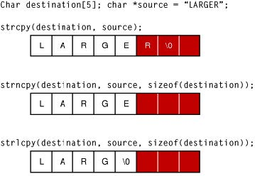
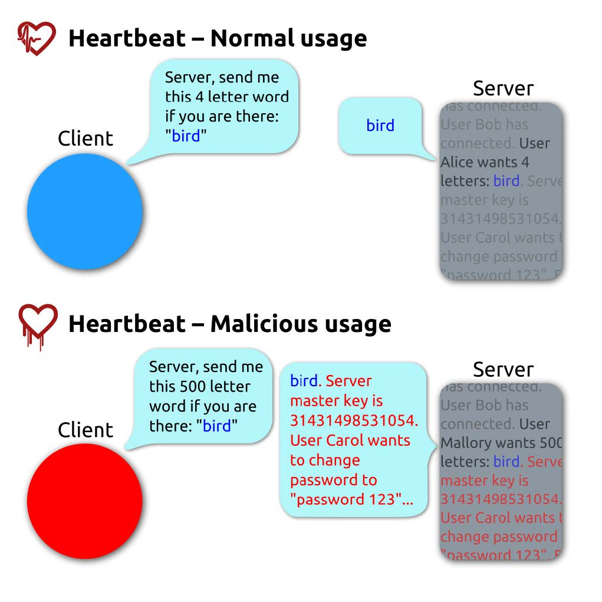

# 十八、内存

> 作者：Peter Yaworski

> 译者：[飞龙](https://github.com/)

> 协议：[CC BY-NC-SA 4.0](http://creativecommons.org/licenses/by-nc-sa/4.0/)

## 描述

缓冲区溢出是一个场景，一种程序向缓冲区或内容区域写入数据，写入的数据比实际分配的区域要多。使用冰格来考虑的话，你可能拥有 12 个空间，但是只想要创建 10 个。在填充格子的时候，你添加了过多的水，填充了 11 个位置而不是 10 个。你就溢出了冰格的缓存区。

缓冲区溢出在最好情况下，会导致古怪的程序行为，最坏情况下，会产生严重的安全漏洞。这里的原因是，使用缓冲区移除，漏洞程序就开始使用非预期数据覆盖安全数据，之后会调用它们。如果这些发生了，覆盖的代码会是和程序的预期完全不同的东西，这会产生错误。或者，恶意用户能够使用移除来写入并执行恶意代码。

这里是来自 Apple 的一个图片：



这里第一个例子展示了可能的缓冲区溢出。`strcpy`接受字符串`Larger`，并将其写入到内存，无论分配的可用空间（白色格子），以及将其写入非预期的内容中（红色格子）。

### 越界读取

除了越过分配的内容写入数据之外，另一个漏洞时越过内容边界读取数据。这是一类缓冲区溢出，因为内容被越界读取，这是缓存区不允许的。

越界读取数据漏洞的一个著名的近期示例，是 OpenSSL Heartbleed 漏洞，在 2014 年 4 月发现。在发现的时候，大约 17%（500K）的互联网安全服务器，由可信授权机构颁发证书，被认为存在此漏洞。

Heartbleed 可以利用来盗取服务器的私钥，回话数据，密码，以及其他。它通过向服务器发送“Heatbleed 请求”消息来执行，服务器会向请求者发送相同信息。消息包含长度参数。那些漏洞服务器会基于长度参数为消息分配内存，而不验证消息的真实大小。

因此，Heartbleed 消息通过发送小型消息以及较大的长度参数来利用，存在漏洞的接受者会读取额外数据，这超出了为消息分配的内存长度。这里是来自维基百科的图片：



虽然缓冲区溢出需要更详细的分析，读取越界和 Heartbleed 超出了本书的范围。如果你对它们感兴趣，这里是一些不错的资源：

+ [Apple 的文档](https://developer.apple.com/library/mac/documentation/Security/Conceptual/SecureCodingGuide/Articles/BufferOverflows.html)

+ [维基百科：缓冲区溢出词条](https://en.wikipedia.org/wiki/Buffer_overflow)

+ [维基百科：NOP 垫](https://en.wikipedia.org/wiki/NOP_slide)

+ [OWASP：缓冲区溢出](https://www.owasp.org/index.php/Buffer_Overflow)

+ [`heartbleed.com`](http://heartbleed.com)

### 内存截断

内存截断是一种技巧，用于通过使代码执行一些不常见或者非预期的行为，来发现漏洞。它的效果类似于缓冲区溢出，其中内容在不该暴露的时候暴露了。

一个例子是空字节注入。这发生在提供了空字节`%00`或者十六进制的`0x00`，并导致接收程序的非预期行为时。在 C/C++，或低级编程语言中，空字节表示字符串的末尾，或者字符串的终止符。这可以告诉程序来立即停止字符串的处理，空字节之后的字节就被忽略了。

当代码依赖字符串长度时，它的影响力十分巨大。如果读取了空字节，并停止了处理，长度为 10 的字符串就只剩 5 了。例如：

```
thisis%00mystring
```

这个字符串的长度应该为 15，暗示如果字符串以空字节终止，它的长度为 6。这对于管理自己的内存的低级语言是有问题的。

现在，对于 Web 应用，当 Web 应用和库、外部 API 以及其它用 C 写成的东西交互的时候，这就有关系了。向 URL 传入`%00`可能使攻击者操作更广泛服务器环境中的 Web 资源。尤其是当编程语言存在问题的时候，例如 PHP，它是使用 C 语言编写的。

> OWASP 链接

> 查看 [OWASP 缓冲区溢出](https://www.owasp.org/index.php/Buffer_Overflows)，[OWASP 为缓冲区覆盖和溢出复查代码](https://www.owasp.org/index.php/Reviewing_Code_for_Buffer_Overruns_and_Overflows)，[OWASP 检测缓冲区溢出](https://www.owasp.org/index.php/Testing_for_Buffer_Overflow)，[OWASP 检测堆溢出](https://www.owasp.org/index.php/Testing_for_Heap_Overflow)，[OWASP 检测栈溢出](https://www.owasp.org/index.php/Testing_for_Stack_Overflow)，[OWASP 嵌入空字符](https://www.owasp.org/index.php/Embedding_Null_Code)。

