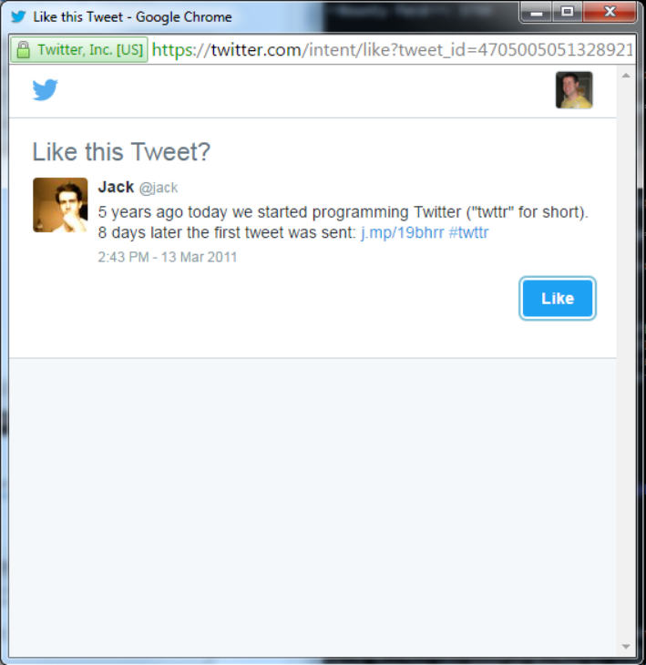

# 六、HTTP 参数污染

> 作者：Peter Yaworski

> 译者：[飞龙](https://github.com/)

> 协议：[CC BY-NC-SA 4.0](http://creativecommons.org/licenses/by-nc-sa/4.0/)

## 描述

HTTP 参数污染，或者 HPP，在网站接受用户输入，将其用于生成发往其它系统的 HTTP 请求，并且不校验用户输出的时候发生。它以两种方式产生，通过服务器（后端）或者通过客户端。

在 StackExchange 上，SilverlightFox 提供了一个 HPP 服务端攻击的不错的例子。假设我们拥有以下站点：`https://www.example.com/transferMoney.php`，它可以通过 POST 方法访问，带有以下参数：

```
amount=1000&fromAccount=12345
```

当应用处理请求时，它生成自己的发往其它后端系统的 POST 请求，这实际上会使用固定的`toAccount`参数来处理事务。

分离后端 URL：`https://backend.example/doTransfer.php`

分离后端参数：`toAccount=9876&amount=1000&fromAccount=12345`

现在，如果在提供了重复的参数时，后端仅仅接受最后一个参数，并且假设攻击者修改了发往网站的 POST 请求来提交`toAccount`参数，像这样：

```
amount=1000&fromAccount=12345&toAccount=99999
```

存在 HPP 漏洞的站点就会将请求转发给另一个后端系统，像这样：

```
toAccount=9876&amount=1000&fromAccount=12345&toAccount=99999
```

这里，由恶意用户提交的第二个`toAccount`参数，会覆盖后端请求，并将钱转账给恶意用户调教得账户（`99999`）而不是由系统设置的预期账户（`9876`）。

如果攻击者打算修改它们自己的请求，并且由漏洞系统处理，这非常实用。但是如果攻击者可以从另一个攒点生产链接，并且诱使用户无意中提交恶意请求，并带有由攻击者附加的额外参数，它也可以对攻击者更加实用一些。

另一方面，HPP 客户端涉及到向链接和其它`src`属性注入额外的参数。在 OWASP 的一个例子中，假设我们拥有下列代码：

```php
<? $val=htmlspecialchars($_GET['par'],ENT_QUOTES); ?> <a href="/page.php?action=view&par='.<?=$val?>.'">View Me!</a>
```

它从 URL 接受`par`的值，确保它是安全的，并从中创建链接。现在，如果攻击者提交了：

```
http://host/page.php?par=123%26action=edit
```

产生的链接可能为：

```html
<a href="/page.php?action=view&par=123&amp;action=edit">View Me!</a> 
```

这会导致应用接受编辑操作而不是查看操作。

HPP 服务端和客户端都依赖于所使用的的后端技术，以及在收到多个名称相同的参数时，它的行为如何。例如，PHP/Apache 使用最后一个参数，Apache Tomcat 使用第一个参数，ASP/IIS 使用所有参数，以及其他。所以，没有可用于提交多个同名参数的单一保险的处理方式，发现 HPP 需要一些经验来确认你所测试的站点如何工作。

## 示例

### 1\. HackerOne 社交分享按钮

难度：低

URL：https://hackerone.com/blog/introducing-signal-and-impact

报告链接；https://hackerone.com/reports/105953

报告日期：2015.12.18

奖金：$500

描述：HackerOne 包含链接，用于在知名社交媒体站点上分享内容，例如 Twitter，Fackbook，以及其他。这些社交媒体的链接包含用于社交媒体链接的特定参数。

攻击者可以将另一个 URL 参数追加到链接中，并让其指向任何他们所选的站点。HackerOne 将其包含在发往社交媒体站点的 POST 请求中，因而导致了非预期的行为。这就是漏洞所在。

漏洞报告中所用的示例是将 URL：

https://hackerone.com/blog/introducing-signal

修改为：

https://hackerone.com/blog/introducing-signal?&u=https://vk.com/durov

要注意额外的参数`u`。如果恶意更新的链接有 HackerOne 访客点击，尝试通过社交媒体链接分享内容，恶意链接就变为：

https://www.facebook.com/sharer.php?u=https://hackerone.com/blog/introducing-signal?&u=https://vk.com/durov

这里，最后的参数`u`就会拥有比第一个更高的优先级，之后会用于 Fackbook 的发布。在 Twitter 上发布时，建议的默认文本也会改变：

https://hackerone.com/blog/introducing-signal?&u=https://vk.com/durov&text=another_site:https://vk.com/durov

> 重要结论

> 当网站接受内容，并且似乎要和其他 Web 服务连接时，例如社交媒体站点，一定要寻找机会。

> 这些情况下，被提交的内容可能在没有合理安全检查的情况下传递。


### 2\. Twitter 取消订阅提醒

难度：低

URL：twitter.com 

报告链接：https://blog.mert.ninja/twitter-hpp-vulnerability/

报告日期：2015.8.23

奖金：$700

描述：

2015 年 8 页，黑客 Mert Tasci 在取消接收 Twitter 的提醒时，注意到一个有趣的 URL。

https://twitter.com/i/u?t=1&cn=bWV&sig=657&iid=F6542&uid=1134885524&nid=22+26

（我在书里面把它缩短了一些）。你注意到参数 UID 了嘛？这碰巧是你的 Twitter 账户 UID。现在，要注意，他做了我认为多数黑客都会做的事情，他尝试将 UID 修改为其它用户，没有其它事情。Twitter 返回了错误。

考虑到其他人可能已经放弃了，Mert 添加了第二个 UID 参数，所以 URL 看起来是这样：

https://twitter.com/i/u?iid=F6542&uid=2321301342&uid=1134885524&nid=22+26

然后就成功了。他设法取消订阅了其它用户的邮件提醒。这就说明，Twitter 存在 HPP 取消订阅的漏洞。

> 重要结论

> 通过一段简短的描述，Mert 的努力展示了坚持和知识的重要性。如果它在测试另一个作为唯一参数的 UID 之后，远离了这个漏洞，或者它根本不知道 HPP 类型漏洞，他就不会收到 $700 的奖金。

> 同时，要保持关注参数，类似 UID，它们包含在 HTTP 请求中，因为我在研究过程中见过很多报告，它们涉及到操纵参数的值，并且 Web 应用做出了非预期的行为。

### 3\. Twitter Web Intents

难度：低

URL：twitter.com

报告链接：https://ericrafaloff.com/parameter-tampering-attack-on-twitter-web-intents

报告日期：2015.11

奖金：未知

描述：

根据它们的文档，Twitter Web Intents，提供了弹出优化的数据流，用于处理 Tweets & Twitter 用户：发推、回复、转发、喜欢和关注。它使用户能够在你的站点上下文中，和 Twitter 的内容交互，而不需要离开页面或者授权新的应用来交互。这里是它的一个示例：



Twitter Intent

充分测试之后，黑客 Eric Rafaloff 发现，全部四个 Intent 类型：关注用户、喜欢推文、转发和发推，都存在 HPP 漏洞。

根据他的博文，如果 Eric 创建带有两个`screen_name`参数的 URL：

https://twitter.com/intent/follow?screen_name=twitter&scnreen_name=erictest3

Twitter 会通过让第二个`screen_name`比第一个优先，来处理这个请求。根据 Eric，Web 表单类似这样：

```html
<form class="follow " id="follow_btn_form" action="/intent/follow?screen_name=er\ icrtest3" method="post"> <input type="hidden" name="authenticity_token" value="..."> 
    <input type="hidden" name="screen_name" value="twitter">

    <input type="hidden" name="profile_id" value="783214">

    <button class="button" type="submit"> 
        <b></b><strong>Follow</strong> 
    </button> 
</form>
```

受害者会看到在一个`screen_name`中定义的用户资料，`twitter`，但是点击按钮后，它们会关注`erictest3`。

与之类似，当展现 intent 用于喜欢时，Eric 发现它能够包含`screen_name `参数，虽然它和喜欢这个推文毫无关系，例如：

https://twitter.com/intent/like?tweet_id=6616252302978211845&screen_name=erictest3

喜欢这个推文会向受害者展示正确的用户资料，但是点击“关注”之后，它仍然会关注`erictest3`。

> 重要结论

> 这个类似于之前的 Twitter UID 漏洞。不出意料，当一个站点存在 HPP 漏洞时，它就可能是更广泛的系统化问题的指标。有时如果你找到了类似的漏洞，它值得花时间来整体探索该平台，来看看是否存在其它可以利用相似行为的地方。这个例子中，就像上面的 UID，Twitter 接受用户标识，`screen_name`，它基于后端逻辑易受 HPP 攻击。

## 总结

HTTP 参数污染的风险实际上取决于后端所执行的操作，以及被污染的参数提交到了哪里。

发现这些类型的漏洞实际上取决于经验，比其他漏洞尤甚，因为网站的后端行为可能对于黑客来说是黑盒。常常，作为一个黑客，对于后端在接收了你的输入之后进行了什么操作，你需要拥有非常细微的洞察力。

通过尝试和错误，你可能能够发现一些情况，其中站点和其它服务器通信，之后开始测试参数污染。社交媒体链接通常是一个不错的第一步，但是要记住保持挖掘，并且当你测试类似 UID 的参数替换时，要想到 HPP。
