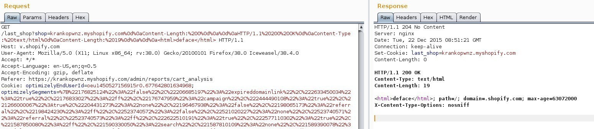

# 七、CRLF 注入

> 作者：Peter Yaworski

> 译者：[飞龙](https://github.com/)

> 协议：[CC BY-NC-SA 4.0](http://creativecommons.org/licenses/by-nc-sa/4.0/)

CRLF 注入是一类漏洞，在用户设法向应用插入 CRLF 时出现。在多种互联网协议中，包括 HTML，CRLF 字符表示了行的末尾，通常表示为`\r\n`，编码后是`%0D%0A`。在和 HTTP 请求或响应头组合时，这可以用于表示一行的结束，并且可能导致不同的漏洞，包括 HTTP 请求走私和 HTTP 响应分割。

对 HTTP 请求走私而言，它通常在 HTTP 请求传给服务器，服务器处理它并传给另一个服务器时发生，例如代理或者防火墙。这一类型的漏洞可以导致：

+   缓存污染，它是一种场景，攻击者可以修改缓冲中的条目，并托管恶意页面（即包含 JavaScript）而不是合理的页面。
+   防火墙绕过，它是一种场景，请求被构造，用于避免安全价差，通常涉及 CRLF 和过大的请求正文。
+   请求劫持：它是一种场景，攻击者恶意盗取 HTTPOnly 的 Cookie，以及 HTTP 验证信息。这类似于 XSS，但是不需要攻击者和客户端之间的交互。

现在，虽然这些漏洞是存在的，它们难以实现。我在这里引用了它们，所以你对如何实现请求走私有了更好的了解。

而对于 HTTP 响应分割来说，攻击者可以设置任意的响应头，控制响应正文，或者完全分割响应来提供两个响应而不是一个，它在示例 #2 （Shopify 响应分割）中演示（如果你需要 HTTP 请求和响应头的备忘录，请回到“背景”一章）。

## 1\. Twitter HTTP 响应分割

难度：高

URL：`https://twitter.com/i/safety/report_story`

报告链接：`https://hackerone.com/reports/52042`

报告日期：2015.4.21

奖金：$3500

描述：

2015 年 4 月，有报告称，Twitter 存在一个漏洞，允许攻击者通过将信息添加到发往 Twitter 的请求，设置任意 Cookie。

本质上，在生成上面 URL 的请求之后（一个 Twitter 的遗留功能，允许人们报告广告），Twitter 会为参数`reported_tweet_id`返回 Cookie。但是，根据报告，Twitter 的验证存在缺陷，它用于确认推文是否是数字形式。

虽然 Twitter 验证了换行符`0x0a`不能被提交时，验证机制可以通过将字符编码为 UTF-8 来绕过。这么做之后，Twitter 会将字符转换会原始的 Unicode，从而避免了过滤。这是所提供的示例：

```
%E5%98%8A => U+560A => 0A
```

这非常重要，因为换行符在服务器上被解释为这样的东西，创建新的一行，服务器读取并执行它，这里是用于添加新的 Cookie。

现在，当 CRLF 攻击允许 XSS 攻击的时候（请见 XSS 一章），它们还会更加危险。这种情况下，由于 Twitter 的过滤器被绕过了，包含 XSS 攻击的新的响应可能返回给用户，这里是 URL：


```
https://twitter.com/login?redirect_after_login=https://twitter.com:21/%E5%98%8A
%E5%98%8Dcontent-type:text/html%E5%98%8A%E5%98%8Dlocation:%E5%98%8A%E5%98%8D
%E5%98%8A%E5%98%8D%E5%98%BCsvg/onload=alert%28innerHTML%28%29%E5%98%BE
```

要注意`%E5%E98%8A`布满了这个 URL。如果我们接受了这些字符，并且实际添加了换行符，这个就是协议头的样子：

```
https://twitter.com/login?redirect_after_login=https://twitter.com:21/
content-type:text/html
location:%E5%98%BCsvg/onload=alert%28innerHTML%28%29%E5%98%BE
```

你可以看到，换行符允许了创建新的协议头，并和可执行的 JavaScript 一起返回：`svg/onload=alert(innerHTML)`。使用这个代码，恶意用户就能够盗取任何无防备的受害者的 Twitter 会话信息。

> 重要结论

> 好的攻击是观察与技巧的组合这里，报告者`@filedescriptor`了解之前的 Firefox 编码漏洞，它错误处理了编码。对这个知识的了解就可以用于测试 Twitter 上相似的编码来插入换行。

> 当你寻找漏洞时，始终记住要解放思想，并提交编码后的值来观察站点如何处理输入。

## 2\. Shopify 响应分割

难度：中

URL：`v.shopify.com/last_shop?x.myshopify.com`

报告链接：`https://hackerone.com/reports/106427`

报告日期：2015.12.22

奖金：$500

描述：

Shopify 包含了一些隐藏功能，会在你的浏览器上设置 Cookie，它指向你所登录的最后一个商店。它通过终端`/last_shop?SITENAME.shopify.com`来实现。

在 2015 年 12 月，有人发现，Shopify 不验证在调用中传入的`shop`参数。所以，使用 Burp Suite，白帽子就能够使用`%0d%0a`来修改请求，并生成协议头返回给用户。这里是截图：



这里是恶意代码：

```
%0d%0aContent-Length:%200%0d%0a%0d%0aHTTP/1.1%20200%20OK%0d%0aContent-Type:%20te\
xt/html%0d%0aContent-Length:%2019%0d%0a%0d%0a<html>deface</html>
```

这里，`%20`表示空格，`%0d%0a`是 CRLF。所以浏览器收到了两个协议头，并渲染了第二个，它能够导致很多漏洞，包括 XSS。

> 重要结论

> 一定要寻找这样的机会，其中站点接受你的输入，并且将其用于返回协议头的一部分。这里，Shopify 使用`last_shop`值创建了 Cookie，它实际上可悲用户克隆的 URL 参数污染。这是一个不错的信号，它可能存在 CRLF 注入漏洞。

## 总结

良好的攻击是观察和技巧的结合。了解如何使用编码字符串来发现漏洞是一个不错的技巧。`%0D%0A`可以用于测试服务器，以及判断他们是否存在 CRLF 漏洞。如果存在，进一步尝试使用 XSS 注入来组合盖漏洞（请见第七节）。

另一方面，如果服务器不响应`%0D%0A`，要考虑如何再次编码这些字符，并测试服务器，以便观察它是否解码双重编码的字符，就像`@filedescriptor`所做的那样。

一定要寻找这样的机会，其中站点使用提交的值来返回一些类型的协议头，例如创建 Cookie。
